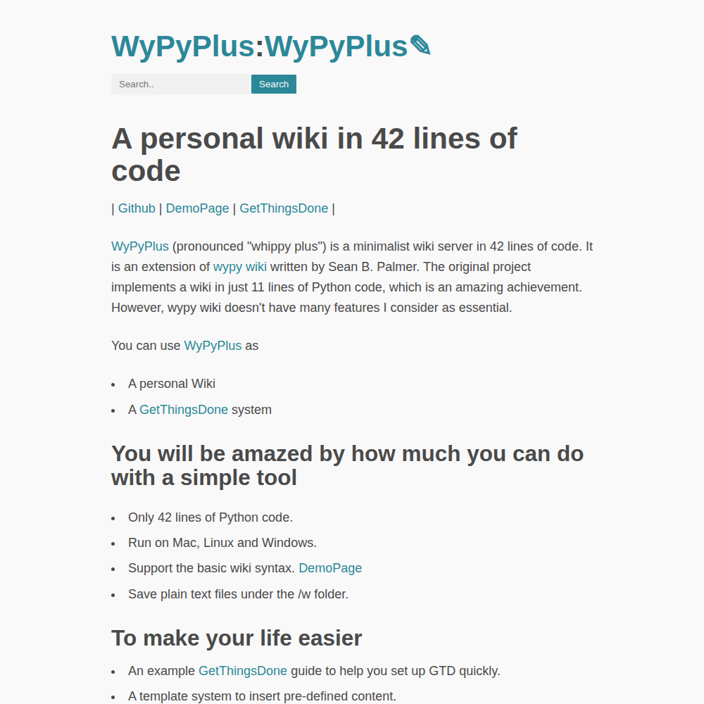

# 🍦 WyPyPlus

A personal wiki in one Python file. 42 lines. No dependencies.

Pages are plain text files in the `w` folder. No database, no config, no build step.



## Features

* One Python file, 42 lines. Nothing to install except Python 3.
* Runs on Mac, Linux and Windows.
* Pages are plain text files in the `w` folder. No database, no config.
* WikiWord links, markdown-style formatting and tables.
* Full-text search and an index of all pages.
* Tags: `@Tag` links to every page that mentions it.
* Templates for new pages, and `INCLUDE(PageName)` to pull one page into another.
* A `GlobalMenu` page that shows on every page.
* Delete a page by saving it empty.
* Optional read-only mode.
* A clean, mobile-friendly look with [Sakura CSS](https://github.com/oxalorg/sakura).
* An example [GetThingsDone](w/GetThingsDone) guide to set up a GTD system.

## Quick start

You need Python 3.8 or newer.

```
git clone https://github.com/lchen198/wypyplus
cd wypyplus
python3 wypyplus.py
```

Open http://127.0.0.1:8000 and start writing. Press Ctrl-C to stop.

## Writing pages

| You type | You get |
| --- | --- |
| `WikiWord` | A link to that page. Click the `?` to create it. |
| `# Title`, `## Title`, `### Title` | Headings |
| `**bold**` | **bold** |
| `[text](https://example.com)` | A link |
| `` | An image |
| `---` | A horizontal line |
| ```` ``` ```` on its own line, before and after | A code block |
| `{{`, then `* item` lines, then `}}` | A bulleted list |
| `@Tag` | A link to every page that mentions `@Tag` |
| `INCLUDE(PageName)` on its own line | The content of another page |
| A YouTube link | An embedded video |

More examples are in the [DemoPage](w/DemoPage).

## Good to know

* **Delete a page:** save it with no text.
* **Templates:** a page named `Tpl` plus three letters (e.g. `TplJan`) is the starting text for new pages that begin with those letters (e.g. `Jan23`).
* **Today:** `?p=Today` opens a page named after today's date, such as `Oct2`.
* **Menu:** text in a page named `GlobalMenu` appears on every page.
* **See all pages:** search for `All`.
* **Read-only mode:** in `wypyplus.py`, change `'✎'` to `''`. Editing, saving and search are turned off.

## Hosting with a password

WyPyPlus has no login, and anyone who can reach it can edit pages. To share it on your network, keep it running on 127.0.0.1 and put nginx or lighttpd in front of it with a password. Keep `python3 wypyplus.py` running in the background (for example in `tmux`, or as a systemd service).

### nginx

```
sudo apt install nginx apache2-utils
sudo htpasswd -c /etc/nginx/wiki.htpasswd alice    # asks for a password; drop -c to add more users
sudo rm /etc/nginx/sites-enabled/default           # the default site would take port 80
```

Create `/etc/nginx/conf.d/wypyplus.conf`:

```
server {
    listen 80;
    location / {
        auth_basic "WyPyPlus";
        auth_basic_user_file /etc/nginx/wiki.htpasswd;
        proxy_pass http://127.0.0.1:8000;
    }
}
```

Then run `sudo nginx -t && sudo systemctl reload nginx` and open http://your-server/.

### lighttpd

```
sudo apt install lighttpd apache2-utils
sudo htpasswd -c /etc/lighttpd/wiki.htpasswd alice
```

Add to the end of `/etc/lighttpd/lighttpd.conf`:

```
server.modules += ( "mod_auth", "mod_authn_file", "mod_proxy" )
auth.backend = "htpasswd"
auth.backend.htpasswd.userfile = "/etc/lighttpd/wiki.htpasswd"
auth.require = ( "/" => ( "method" => "basic", "realm" => "WyPyPlus", "require" => "valid-user" ) )
proxy.server = ( "" => ( ( "host" => "127.0.0.1", "port" => 8000 ) ) )
```

Then run `sudo systemctl restart lighttpd` and open http://your-server/.

Basic auth sends the password unencrypted over plain HTTP. That's fine on a network you trust; otherwise add HTTPS (for example with [Let's Encrypt](https://letsencrypt.org/)).

`wypyplus.py` is a standard [WSGI](https://peps.python.org/pep-3333/) app, so you can also run it with any WSGI server, e.g. `gunicorn wypyplus:app`.

## Security

* Page text is HTML-escaped, and links and images only accept `http(s)://` or relative URLs.
* Pages run no JavaScript: a `Content-Security-Policy` header blocks all scripts.
* Other websites can't edit or delete your pages through your browser: cross-site form posts are rejected (in browsers that send `Sec-Fetch-Site`, which all current ones do).
* Page names can only contain letters and digits, so they can't point outside the `w` folder.

## Credits

Based on [wypy](http://infomesh.net/2003/wypy/), an 11-line wiki written by Sean B. Palmer for the [ShortestWikiContest](http://wiki.c2.com/?ShortestWikiContest). Styled with [Sakura CSS](https://github.com/oxalorg/sakura).

## License

MIT. See [LICENSE](LICENSE).
