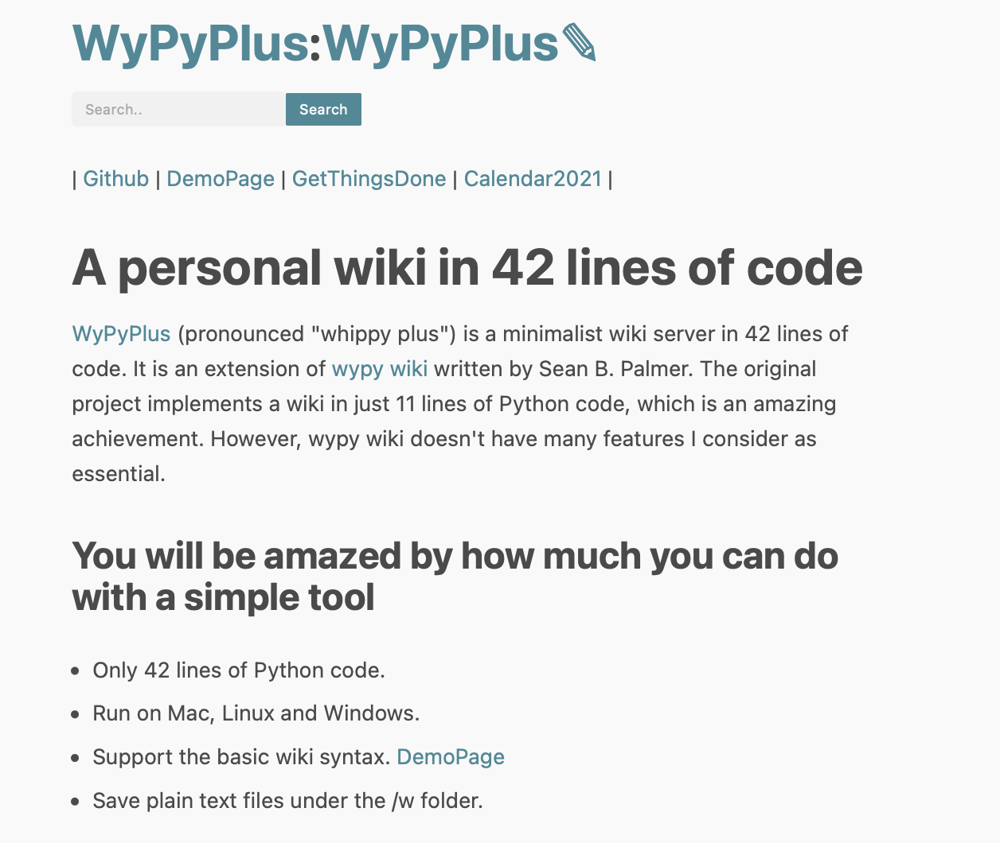
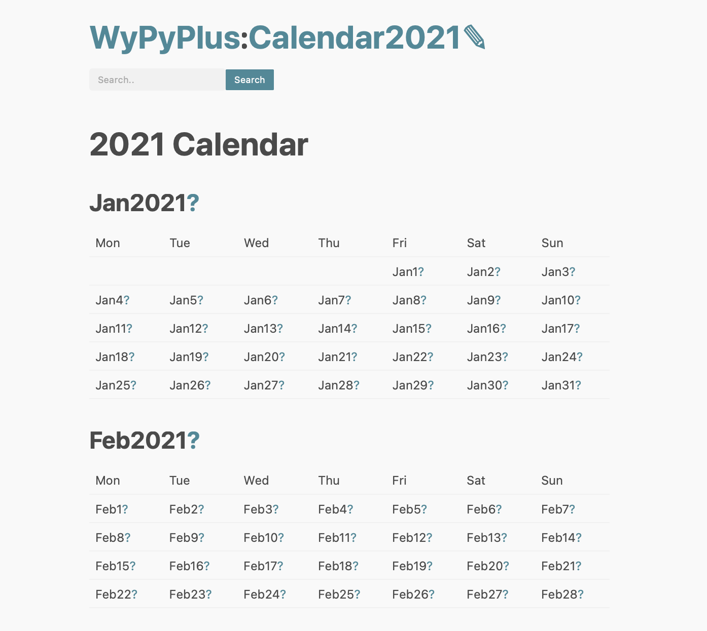

# WyPyPlus: A personal wiki in 23 lines of code

WyPyPlus (pronounced "whippy plus") is a minimalist wiki server in 23 lines of code based on [wypy wiki](http://infomesh.net/2003/wypy/) written by Sean B. Palmer in 2004 during a [ShortestWikiContest](http://wiki.c2.com/?ShortestWikiContest).


WyPyPlus is a journey to discover the essence of personal wiki and get rid of everything else. It tries to keep a minimal set of features and pack them in the tiniest space possible.

It tries to be an old typewriter with the magic of linking information. There’s nothing between you and your content. You don’t need to worry about configuration, backup, user authentication, subscription fee, system update and so on. It is just you and your content. At the end of the day, don't you want a Wiki that just works and is free?

Other software projects always tell you that they are easy to set up and easy to use. WyPyPlus tells you that it is easy for you to leave. Your content are text files stored under the /w directory. You can move to other places if you need more than what WyPyPlus offers.

<p align="center">
 
</p>
A minimal editor that does not get in the way.
<p align="center">

</p>
The Built-in Calendar 
<p align="center"></p>

### The key feature of WyPyPluse is the lack of features. You will be amazed by how much you can accomplised with a simple tool.

* Only 23 lines of Python code with no external dependency other than the standard library.
* Runs on Mac, Linux and Windows.
* Support basic wiki syntax. [DemoPage](https://github.com/lchen198/wypyplus/blob/main/w/DemoPage)
* Your files are in the /w folder.

### To make your life easier
* An example calendar and daily journal.
* An example GetThingsDone guide to help you set up GTD quickly.
* A template system to insert pre-defined content.
* Full-text search.
* A modernized and mobile-friendly look using [Sakura CSS](https://github.com/oxalorg/sakura).
* Delete a wiki page from disk by saving an empty content.
* Each WikiPage has a reverse index. You can use this feature to group pages by tags.
* An [index page](http://127.0.0.1:8000/cgi-bin/wypyplus.py?p=All&q=f) to show all your files in sorted order.
* AutoSave after 30 minutes of editing.

<p align="center">

</p>

**Other Benefits** 
* Fast!!
* Takes less than a minute to set up and get going.
* Works perfectly offline.
* No config file to mess with.
* No authentication. It's a personal wiki and you should run it on your own machine. 
* No database. Wiki pages are just text files.
* Low maintenance. Just backup the entire folder. 

**Design Tradeoffs**

* To keep things minimal, WyPyPlus only supports a subset of markdown syntaxes. 
* To avoid depending on an external parser, WyPyPlus uses regular expresisons to match tags. It is not perfect, but farily useable. 
* WyPyPlus has no config file. You can't mis-configure it. If you really need something, just edit the source code.

## Text Formatting
* WikiNames are replaced with internal links.
* Markdown style ```**bold**```
* "\n{{" starts an unordered list.
* "\n* [text]" is a list item in an unordered list.
* "\n}}" ends an unordered list.
* "\n#" inserts H1
* "\n##" inserts H2
* "\n###" inserts H3
* To format code or text into its own distinct block, use triple backticks: \`\`\`.
* "---" creates an \<hr\> element.
* Markdown style [link](https://www.markdownguide.org/basic-syntax/#links) and [image tag](https://www.markdownguide.org/basic-syntax/#images-1).
* All HTML is replaced with its quoted equivalent (i.e. is forbidden).

## Install and Use

* You need Python 2 to run this application. Mac and Linux already have Python 2. For Windows users, please install Python 2.7.

* Download WyPyPlus and extract it to a folder (E.g wypy_wiki).
```
cd wypy_wiki

# Fpr Python 2. Note that the page is exposed in both 127.0.0.1 
# and your local network IP (usually 192.168.x.x). You can use this script to add password authentication.
# https://github.com/lchen198/wypyplus/wiki#how-to-add-password-authentication-in-python-2
python -m CGIHTTPServer 8000 

# For Python 3, you can bind it just to your localhost.
python3 -m http.server --cgi 8000 --bind 127.0.0.1

Open this url in your browser. It takes a few moments to start.
http://127.0.0.1:8000/cgi-bin/wypyplus.py
```

Since the wypyplus file is just a cgi script, you can also use any web server to host it. I don't recommend this since you are likely to spend more time to config the cgi server.

The UI should be fairly self-explanatory. 
* Click the ? mark after a CamelCased word to create a new page.
* Click the Submit button to save a page. If you save an empty page, WyPyPlus will delete it from disk.

### How to create tags?
Tags are just wiki pages. When you create a new page, there will be a link on the top of the screen to show all pages that reference it. 

For example, you can create a page called ToDo, and put the word ToDo to other pages and see references here:
http://127.0.0.1:8000/cgi-bin/wypyplus?p=ToDo&q=f

### How to define and use a template?
You can create a template just like any other wiki page. A template name must start with "Tpl" and follow by three characters. WyPyPlus will automatically insert its content to a new wiki page when the first three characters of the page matches the template

For example, If you create a template page called TplJan, a new page called Jan23 will load the content from the template. 

# I want XYZ but WyPyPlus doesn't support. 

The original wypy code is highly compressed. However, variable names are carefully picked so that the code is still somewhat readable. 

For example, if you don't like the CSS, just replace ```<head><link rel='stylesheet' href='..\sakura.css' type='text/css'></head> ```with whatever you like.

To support new syntax, you can add a tuple of (regex_pattern, replace_pattern). The following example extracts content after ## and enclose it with an h2 headline. 
```
('^## (.*)$', '<h2>\g<1></h2>')
```
Here's the entire source code and my comments. 

```Python
#!/usr/bin/python
# -*- coding: utf-8 -*-  Need this line to support the "edit" button unicode.

# Create shorter names for commonly used functions and variables.
link='\[([^]]*)]\(\s*((?:http[s]?://)?[^)]+)\s*\)';import sys,re,os,cgi;from datetime import timedelta as td;
from datetime import datetime as dt;q,x,h,w=cgi.escape,os.path.exists,'<a href=','wypyplus.py?p='
load,t=lambda n:(x('w/'+n) and open('w/'+n).read()) or '','</textarea></form>'
f,i=cgi.FormContent(),'put type';y=f.get('p',[''])[0];y=('WyPyPlus',y)[y.isalpha()]

# Define a list of (regular expressions, replace patterns). Apply them one by one to convert wiki tags.
# Do cgi.escape on the final content.
fs,do,main=lambda s:reduce(lambda s,r:re.sub('(?m)'+r[0],r[1],s),(('\r',''),(\
# Find WikiWords and replace with html links.
'(^|[^=/\-_A-Za-z0-9?])(([A-Z][a-z]+){2,})',lambda m:(m.group(1)+'%s'+h+w+m.group(2)+\
'%s>%s</a>')%((m.group(2),'&amp;q=e','?'),('','',m.group(2)))[x('w/'+m.group(2))]),\
# Other wiki tags sunch as headline and links. Note that a regular expression can match multiple lines.
('^\{\{$','\n<ul>'),('^\* ','<li>'),('^}}$','</ul>'),('^---$','<hr>'),('```((?:.|\n)+?)```','<pre>\g<1></pre>'),
('^# (.*)$','<h1>\g<1></h1>'),('^## (.*)$', '<h2>\g<1></h2>'),
('^### (.*)$', '<h3>\g<1></h3>'),('\*\*(.*)\*\*','<b>\g<1></b>'),
('\!'+link,'" alt="\g<1>">'),('(^|[^!])'+link,"\g<1>"+h+'"\g<3>">\g<2></a>'),
('(^|[^"])(http[s]?:[^<>"\s]+)',"\g<1>"+h+'"\g<2>">\g<2></a>'),('\n\n','<p>')),q(s)),\

# Generate <HomePage>:<CurrentPage>:<Edit Icon>.
lambda m,n:{'get':'<h1>%s%sWyPyPlus>WyPyPlus</a>:%s%s%s&amp;q=f>%s</a>:%s%s%s&amp;q=e>✎</a></h1><p>%s'%(\

# Add a submit button and compute the time for auto save. 
h,w,h,w,n,n,h,w,n,fs(load(n)) or n),'edit':'<form name="e" action=%s%s method=POST><h1>%s <in'\
'%s=hidden name=p value=%s><in%s=submit></h1>Will auto save at %s<textarea name=t cols=80 rows=24'\
'>%s'%(w,n,fs(n),i,n,i,(dt.now()+td(minutes=30)).strftime("%H:%M"),q(load(n)))+t,'find':('<h1>Links: %s</h1>'%fs(n))+fs(

# Generate a reverse index of a WikiPage. Note tha the "All" page would match every file in the wiki
'{{\n* %s\n}}'%'\n* '.join([d for d in os.listdir('w/') if n == "All" or load(d).count(n)]))

# This part handles a POST request. If the content is empty, delete the file from disk. Otherwise, write the content to a file under the /w folder.
}.get(m),lambda f=f:`(os.getenv("REQUEST_METHOD")!="POST") or ('t' in f or (os.remove('w/'+y) and False))\
and open('w/'+y,'w').write(f['t'][0])`+`sys.stdout.write("Content-type: text/html; charset=utf-8\r\n\r\n"\

# Insert a CSS link and set a timer to save the content in 30 mins (1.8e6 milliseconds) 
"<head><link rel='stylesheet' href='../sakura.css'><script>var wait=setTimeout('document.e.submit();',1.8e6);</script>\
</head><title>%s</title>"%y+do({'e':'edit','f':'find'}.get(f.get('q',[None])[0],'get'),y))`;(__name__=="__main__") and main()
```

